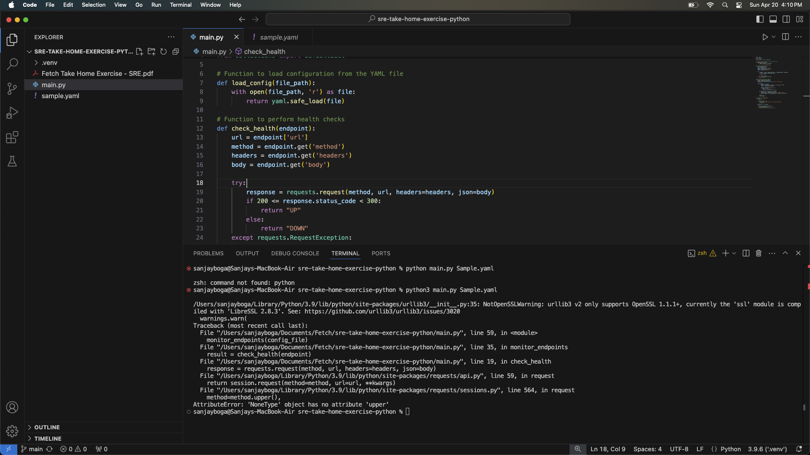
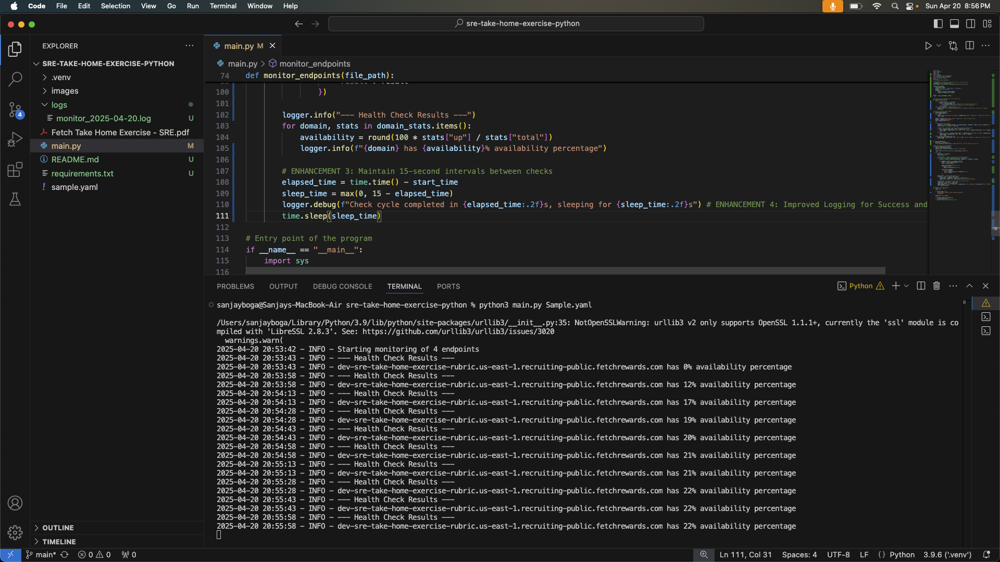
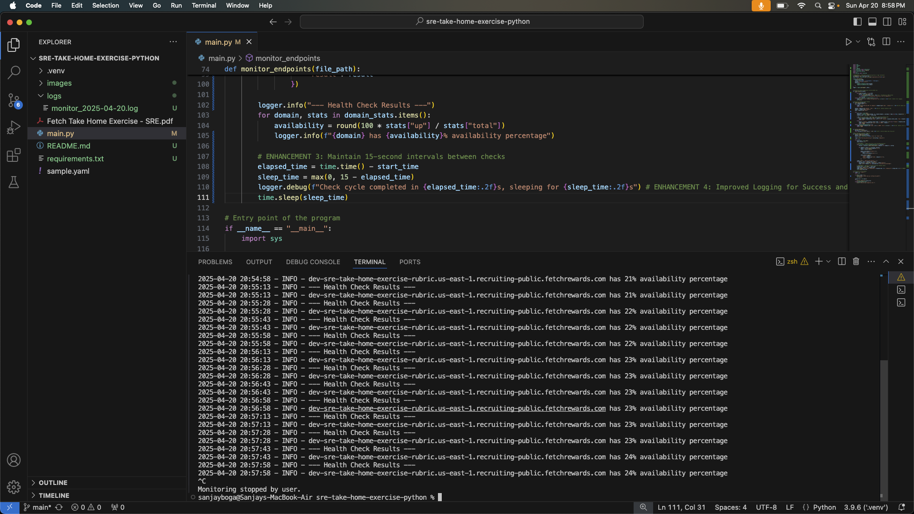
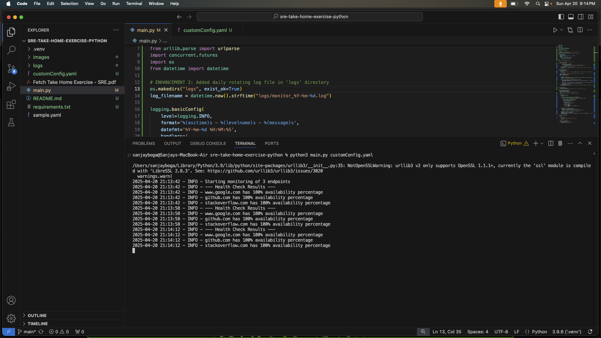

## **Fetch Rewards - Health Monitor Script**

This project is a Python-based health check monitor that continuously checks the availability and responsiveness of web service endpoints defined in a YAML configuration file.

## **1\. Given Requirement**

The following were the original project requirements:

- Must accept a YAML configuration file as a command-line argument.
- YAML format must match that in the provided sample.
- Must accurately determine the availability of all endpoints during every check cycle.
- Output must include the availability percentage per domain.
- Should perform checks every 15 seconds.
- Should be fault-tolerant and log errors without crashing.

## **2\. Installation & Usage**

### 1. Clone the repository
First, clone the repository from GitHub to your local machine:

```bash
git clone https://github.com/iamsanjayboga/sre-take-home-exercise-python
cd sre-take-home-exercise-python
```

### **Installation**
After cloning the repository, install the necessary dependencies using the requirements.txt file:

```bash 
pip install -r requirements.txt 
```

### **Running the Script**
Once the dependencies are installed, you can run the application:

```bash 
python main.py <config_file_path> 

Example 1: python main.py Sample.yaml 
Example 2: python main.py customConfig.yaml 
```

## **3\. Issues Identified in Initial Code**

1. **Default HTTP Method Handling**  
   **Issue**: The original code did not provide a default HTTP method when the `method` field was missing in the endpoint configuration.  
   **Fix**: Assigned `"GET"` as the default method if none is specified, ensuring consistent request behavior.
    ```
    method = endpoint.get('method', 'GET')
    ```

2. **YAML Format Validation**  
   **Issue**: The original code did not validate whether the YAML configuration file was in the correct format (list of endpoints).  
   **Fix**: Added a check to ensure the loaded YAML is a list. If not, the program exits with an error, preventing invalid configurations from causing runtime issues.
    ```
    if not isinstance(config, list):
        raise ValueError("Configuration should be a list of endpoints")
    return config
    ```

3. **Timeout Handling**  
   **Issue**: The original code did not enforce a response timeout, which could lead to hanging if a server did not respond.  
   **Fix**: Added a 500ms timeout to all HTTP requests and validated both response time and status code to mark endpoints as UP or DOWN.
    ```
    response = requests.request(method, url, headers=headers, json=body if body else None, timeout=0.5)
    ```

4. **Missing URL Handling**  
   **Issue**: If an endpoint configuration was missing a URL field, it could cause a crash or undefined behavior.  
   **Fix**: Added a guard clause that checks for the URL field and logs a meaningful error if it's missing, returning "DOWN" for that endpoint.
    ```
    if not url:
        logger.error(f"Missing URL for endpoint: {endpoint.get('name', 'unknown')}")
        return "DOWN"
    ```

5. **Improved Error Logging**  
   **Issue**: Errors were logged vaguely or printed directly, making debugging difficult.  
   **Fix**: Switched to structured `logger.debug`/`logger.error` messages with required information like endpoint names and specific exception messages.
    ```
    logger.debug(f"{endpoint.get('name', url)} is DOWN - Error: {str(e)}")
    ```

6. **Domain Extraction Accuracy**  
   **Issue**: Domain names were extracted along with port numbers, which caused inaccurate grouping of stats per domain.  
   **Fix**: Used `urllib.parse.urlparse` to extract the domain cleanly and strip any port numbers, ensuring correct domain-based stats.
    ```
    parsed_url = urlparse(url)
    return parsed_url.netloc.split(':')[0]    
    ```

## **4\. Summary - Fixes Made for the Above Issues**

| **Bug #** | **Description** | **Fix** |
| --- | -------------------------------------- |----------------------------------------- |
| #1  | Default method not handled | Added default GET for missing method |
| #2  | Invalid YAML structure | Added type validation after loading YAML |
| #3  | No timeout in requests | Added 500ms timeout to HTTP requests |
| #4  | URL field may be missing | Added guard clause to check for URL |
| #5  | Vague logging | Switched to logger.debug / logger.error with required messages |
| #6  | Port in domain affected stats | Extracted domain name without port |


## **5. Key Enhancements and Their Benefits**

| **Enh. #** | **Enhancement Description**                          | **Implementation**                                                                 |
|------------|------------------------------------------------------|-------------------------------------------------------------------------------------|
| #1         | Added concurrency for faster health checks           | Integrated `ThreadPoolExecutor` to execute multiple endpoint checks in parallel     |
| #2         | Enabled daily rotation of log files                  | Configured logging to store output in date-based files inside the `logs/` directory |
| #3         | Maintained consistent monitoring intervals           | Ensured each health check cycle runs every 15 seconds by adjusting sleep time       |
| #4         | Enhanced logging for better observability            | Added detailed logs showing both success and failure with contextual messages       |


## **6. Benefits of Enhancements**

These enhancements significantly improve the robustness, clarity, and efficiency of the monitoring system:

- **Faster Monitoring with Concurrency**  
  Parallel health checks reduce the time required per monitoring cycle, allowing quicker detection of failures.

- **Simplified Log Management**  
  Daily log rotation keeps the logging organized and manageable over time, aiding in debugging and traceability.

- **Consistent Monitoring Intervals**  
  Health checks run precisely every 15 seconds, improving reliability and reducing drift in monitoring frequency.

- **Better Observability and Debugging**  
  Enhanced logging provides clear insights into system behavior, making troubleshooting faster and easier.


## **6. Screenshots: Error vs Working**

### Error State

This is a screenshot showing the error state before the fixes were implemented.

Input File: Sample.yaml



### Working State

This is a screenshot showing the system after the fixes, demonstrating it is now working correctly.

Input File: Sample.yaml





Input File: customConfig.yaml



## **7. Conclusion**

All the original requirements have been implemented successfully, and additional enhancements have been made to improve performance, logging, and reliability.


###

###
