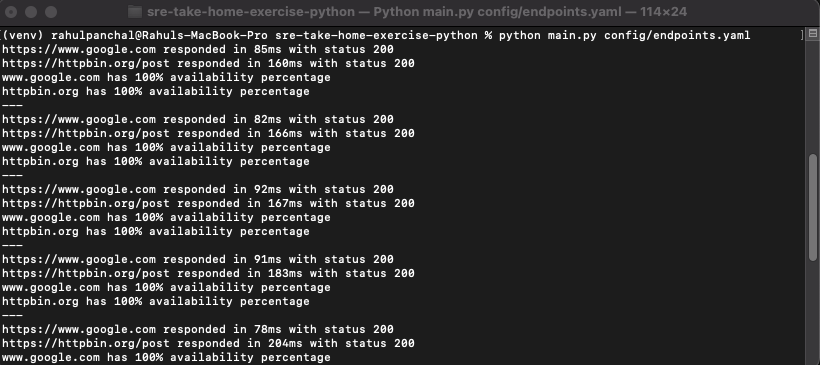

# Site Reliability Engineering - Endpoint Availability Monitor

This is a command-line tool written in Python to monitor the availability of HTTP endpoints, as part of the Fetch Rewards Site Reliability Engineering take-home exercise.

## 📋 Overview

As a Site Reliability Engineer, it's important to monitor service uptime and build processes that help others identify and respond to incidents. This tool checks HTTP endpoints periodically and reports cumulative availability by domain, helping identify reliability trends over time.

---

## ✅ Features

- Accepts configuration via a YAML file.
- Periodic health checks every 15 seconds.
- Availability calculated **cumulatively** per domain.
- Endpoints are considered **available** only if:
  - HTTP status code is between `200` and `299`.
  - Response time is `≤ 500ms`.
- Port numbers in URLs are ignored when grouping by domain.

---

## 🚀 Getting Started

### Prerequisites

- Python 3.7+
- `pip` for managing dependencies
- (Optional but recommended) a virtual environment

### Install Dependencies

```bash
pip install -r requirements.txt
```

or manually

```bash
pip install requests pyyaml
```

### ✅ Check for endpoints.yaml

If config/endpoints.yaml file doesn't exist then create a YAML file like config/endpoints.yaml:

```bash
- name: Google
  url: https://www.google.com
- name: HTTPBin
  url: https://httpbin.org/status/200
  method: GET
```

### Run the Montior

```bash
python main.py config/endpoints.yaml
```

### Your output should look like



## 🛠️ Code Changes and Improvements

### 1. Availability Calculation

- **Issue:** The initial code did not calculate the availability cumulatively over time.
- **Solution:** Implemented logic to track the number of "UP" and "DOWN" responses for each domain across multiple check cycles, and calculated the availability as a percentage.

### 2. Response Time Validation

- **Issue:** There was no check for response time, leading to endpoints potentially being marked as "UP" even if they took longer than 500ms to respond.
- **Solution:** Added a validation step that ensures an endpoint is only considered "UP" if its response time is ≤ 500ms.

### 3. Domain Parsing

- **Issue:** Domain names were not parsed correctly, especially when port numbers were included in the URL.
- **Solution:** Implemented a function that extracts the domain name from the URL while ignoring port numbers.

### 4. Error Handling for Failed Requests

- **Issue:** The initial code did not properly handle failed HTTP requests.
- **Solution:** Introduced exception handling to catch request failures and classify those endpoints as "DOWN".

---

### 📋 Conclusion

These changes ensure the tool meets the provided requirements, including cumulative availability reporting, response time validation, and ignoring port numbers when determining domain availability.
